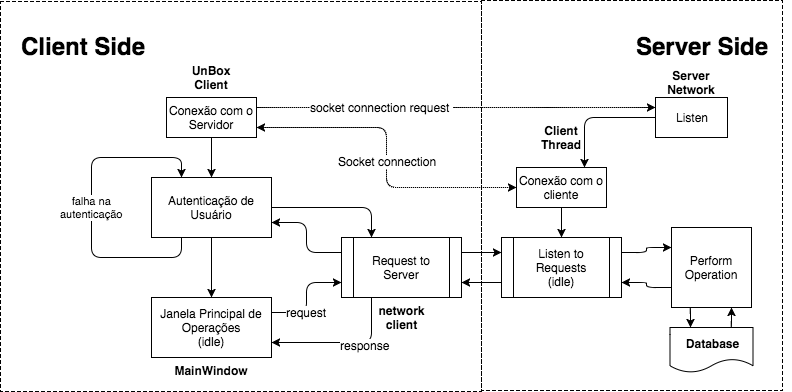

UnBox: Aplicação Dropbox-like
====================================

### Trabalho final da disciplina Transmissão de Dados 2018.1 da Universidade de Brasília (UnB-CIC)

### Autoria

* **Autor: Pedro Henrique Suruagy Perruci | pedro.perruci@gmail.com | 14/0158596**
* Professor: Marcos F. Caetano | mfcaetano@unb.br
* Monitoras:
  * Camila Camargo | 130104868@aluno.unb.br
  * Mariana Makiuchi | marimakiuchi@aluno.unb.br
  
### 1. Objetivos

Através do desenvolvimento do sistema UnBox pretende-se aplicar os conhecimentos explorados na disciplina Transmissão de Dados.
Os principais conceitos trabalhados são a implementação de um sistema na camada de aplicação do modelo OSI e o desenvolvimento de um protocolo de comunicação simplificado cliente-servidor capaz de realizar as operações especificadas.
Os conceitos chaves da aplicação são a **sincronização** e o **armazenamento** de arquivos do usuário.

Ao lidar com a manipulação de arquivos e o acesso concorrente ao servidor também é possivel relembrar, ou adiantar, conceitos das disciplinas de Organização de Arquivos e Processamento em Tempo Real, embora não sejam o foco deste trabalho.

### 2. Especificações

Tendo como referência as especificações propostas no roteiro do trabalho, estipulou-se os seguintes requisitos para o sistema:

1. Aplicação em linha de comando compatível com sisetmas linux;
2. Cliente e servidor se comunicam em rede e operam em pastas diferentes;
3. O servidor é capaz de atender múltiplos clientes simultâneamente;
4. Sincronização entre arquivos no cliente e servidor de forma persistente;
5. Operações realizadas tanto no cliente, como no servidor são armazenadas em arquivos log.

Estas especificações serão abordadas individualmente nas seções seguintes.

#### 2.1 Linguagem e Dependências
O sistema foi desenvolvido na linguagem Python 3.6.5, em ambiente OSX 10.13.5. 
O funcionamento do sistema em sistema Ubuntu 16.04 foi verificado como adequado.

Todas as dependências foram armazenadas em um ambiente virtual [Pipenv](https://docs.pipenv.org).
Portanto para a execução da aplicação é necessária apenas a instalação do ambiente virtual.

```bash
sudo apt-get install -y python3-pip
pip3 install pipenv
```

Uma lista completa dos módulos utilizadas no sistema está expressa a seguir:
* Python 3.6.5
    * ruamel.yaml (pipenv)
    * socket
    * threading
    * logging
    * time
    * sys
    * os
    
#### 2.2 Disposição de Arquivos

A disposição de arquivos esperada ao executar-se o sistema está disposta a seguir.
Os arquivos destacados são criados durante a execução da aplicação e desempenham função essencial no sistema.
Note que a pasta 'UnBox/scripts' contém alguns arquivos executáveis úteis para a utilização e manutenção da aplicação

```
UnBox
├── LICENSE
├── Pipfile
├── Pipfile.lock
├── README.md
├── client
│   ├── client_history.log     <- Client Log
│   ├── home
│   │   └── [Client Workspace] <- Client Workspace
│   └── src
│       ├── main.py
│       ├── main_window.py
│       ├── network_client.py
│       └── unbox_client.py
├── scripts
│   ├── clean_logs.sh
│   ├── clean_user_data.sh
│   ├── init_environment.sh
│   ├── run_client.sh
│   └── run_server.sh
└── server
    ├── database                <- Server Database
    │   └── [Server Files]
    ├── server_history.log      <- Server Log
    ├── src
    │   ├── client_thread.py
    │   ├── database.py
    │   ├── main.py
    │   ├── server_network.py
    │   └── unbox_server.py
    └── user_data.yaml          <- Persistent User Information
```

#### 2.3 Instruções de Execução

Para a chamada adequada do sistema UnBox recomenda-se acessar o diretório root do projeto e inicializar o ambiênte virtual.
Este procedimento deve ser realizado em cada terminal utilizado. 

```bash
cd path/to/UnBox
bash scripts/init_environment.sh
```

Em seguida, realiza-se a chamada do programa server-side pela chamada do script run_server.sh

```bash
cd path/to/UnBox # caso tenha mudado o diretório
bash scripts/run_server.sh
```

Para realizar a chamada do aplicação client-side pela seguinte chamada.

```bash
cd path/to/UnBox # caso tenha mudado o diretório
bash scripts/run_server.sh
```
**Importante 1:** A chamada dos scripts de execução do cliente e do servidor devem ser feitas do diretorio UnBox/.
Os caminhos relativos de arquivos importantes parte d   este diretório.

**Importante 2:** O programa do servidor deve ser sempre chamado antes do programa cliente. Caso o servidor não esteja ativo, o programa cliente não se inicializará.

**Importante 3:** O download de arquivos não suporta caminhos para o arquivo com espaços.

### 3. Exemplo de Execução

#### 3.1 Autenticação de Usuário
A autenticação com o usuário é realizada por meio de uma requisição ao servidor.
Um exemplo de autenticação de usuário pode ser analizado a seguir:

```
Bem vindo ao sistema UnBox

Para ter acesso aos seus dados é necessário efetuar o login.
Caso ainda não tenha uma conta, iremos criar uma para você.

Insira o seu nome de usuário:
 -> Pedro
Insira sua senha:
 -> senha
Username not found...
Create a new user? (y/n)
-> y
User Pedro registered with success
```

#### 3.2 Janela Principal
A interface de usuário desenvolvida baseia-se na linha de comando e em operações discretas listadas na janela principal. Sua chamada padrão pode ser observada no seguinte trecho de execução da aplicação:

```
Olá Pedro o/
Nesta versão do sistema, você é capaz de:
	1 - Visualizar seus arquivos
	2 - Download de um arquivo
	3 - Upload de um arquivo
	4 - Mover um arquivo
	5 - Deletar um arquivo
	6 - Encerrar sessão
Qual operação deseja realizar? (1-6)
->
```

Cabe ao usuário selecionar a operação que deseja realizar ao inserir um valor de 1-6.

#### 3.3 Upload de um Arquivo

A primeira coisa a fazer é adicionar um arquivo ao sistema UnBox.
Para tanto, siga o procedimento a seguir.

```
Qual operação deseja realizar? (1-6)
-> 3
Upload de um arquivo foi a sua escolha
Qual o caminho para o arquivo que deseja enviar?
-> /Users/pedroperruci/Desktop/github/UnBox/docs/roteiro.pdf
Em qual caminho deseja armazená-lo? (nome do arquivo incluso)
-> td/trabalho/roteiro
O upload foi realizado com sucesso
```

Note que é possivel adicionar arquivos arrastando-os do file-manager para o terminal.
Ainda assim, existe uma limitação... lembre-se do **Importante 3** exposto na seção 2.3.

Para verificar como encontra-se o nosso sistema de arquivos, digite 1 no menu principal.

```
Qual operação deseja realizar? (1-6)
-> 1
Visualizar seus arquivos foi a sua escolha
pedro, seu sistema de arquivos atualmente consiste em:
	 - td/trabalho/roteiro
```

Note que o cliente possui total liberdade para criar o sistema de arquivos que lhe interessa no sistema UnBox!

#### 3.4 Download de um Arquivo

Para realizar o download do roteiro do trabalho, caso tenha-o deletado sem querer, digite a opção 2 do menu principal.

```
Qual operação deseja realizar? (1-6)
-> 2
Download de um arquivo foi a sua escolha
pedro, seu sistema de arquivos atualmente consiste em:
	 - td/trabalho/roteiro

Qual o caminho para o arquivo que deseja baixar?
-> td/trabalho/roteiro
Em qual caminho do seu sistema deseja armazená-lo? (a partir de: client/data/)
-> td/roteiro.pdf
```

Em seguida, constate que o diretório *client/home/td* foi criado e contêm o arquivo *roteiro.pdf* !

#### 3.5 Mover Arquivo

Para mover um arquivo, digite a opção 4 no menu principal.
O procedimento será equvalente ao exposto em seguida:

```
Qual operação deseja realizar? (1-6)
-> 4
Mover um arquivo foi a sua escolha
pedro, seu sistema de arquivos atualmente consiste em:
	 - td/trabalho/roteiro

Qual o caminho do arquivo que deseja mover?
-> td/trabalho/roteiro
Qual o caminho de destino do arquivo?
-> td/trabalho/roteiro.pdf
O arquivo foi movido com sucesso
```

Para verificar a mudança, digite 1 no menu principal.

```
Qual operação deseja realizar? (1-6)
-> 1
Visualizar seus arquivos foi a sua escolha
pedro, seu sistema de arquivos atualmente consiste em:
	 - td/trabalho/roteiro.pdf
```

#### 3.6 Remover Arquivo

Remover um arquivo envolve um procedimento semelhante à movê-lo.

```
Qual operação deseja realizar? (1-6)
-> 5
Deletar um arquivo foi a sua escolha
pedro, seu sistema de arquivos atualmente consiste em:
	 - td/trabalho/roteiro.pdf

Qual o caminho para o arquivo que deseja remover?
-> td/trabalho/roteiro.pdf
O arquivo foi removido com sucesso
```

Para verificar a mudança, digite 1 no menu principal.

```
Qual operação deseja realizar? (1-6)
-> 1
Visualizar seus arquivos foi a sua escolha
	pedro, seu sistema de arquivos ainda está vazio...
```

#### 3.7 Encerrar Programa

Para encerrar o programa, basta digitar a opção 6.

Cliente:

```
Qual operação deseja realizar? (1-6)
-> 6
Saindo do programa...
End of client connection
```

Servidor:

```
User pedro at ('127.0.0.1', 54847) disconnected...
```

### 4. Protocolo de Comunicação

O proposto protocolo de comunicação é baseado em requisições realizadas pelo cliente e recebidas pelo servidor. Dessa maneira, um dos desafios do foi desenvolver uma aplicação orientada a eventos no servidor para que este monitore os possíveis clientes e realize as operações especificadas.

#### 4.1 Modelagem em Máquina de Estados

A modelagem em máquina de estados está representada no fluxograma a seguir.
A figura representa o estado do sistema assim que um novo cliente executa a aplicação e solicita a conexão ao servidor. Um breve resumo das funcionalidades será exposto para explicar o fluxograma.

Analisando o "Server Side", após receber uma solicitação de conexão TCP é criada uma nova thread para se conectar ao cliente. Em seguida, esta thread entra em modo idle, em que espera requisições do cliente. Ao receber requisições, realiza as operações necessárias acessando o banco de dados. 

Já no client side, assim que a conexão com o servidor é estabelecida, solicita-se a autenticação do usuário. O par nome de usuário e senha são enviados para o servidor em uma requisição este confere os dados com os armazenados no arquivo *user_data.yaml*. A partir de então, acessa-se a janela principal do cliente, em que é possível solicitar as operações especificadas do servidor.



#### 4.2 Características da Conexão

A conexão é estabelecida por meio de sockets TCP/IP entre os objetos **ClientThread** e **NetworkClient** no server side e client side, respectivamente. Vale notar que **NetworkClient** é um objeto de **UnBoxClient**, que faz a interface entre comunicação em rede e a interface de usuário **MainWindow**.

O trecho de código responsável por realizar a conexão no lado do cliente é chamado no construtor da classe **NetworkClient**. O endereço escolhido é deixado como padrão, o localhost, e a porta foi arbitrariamente escolhida como *8888*.

```python
# trecho extraído de client/src/network_client.py
class NetworkClient:
    """ Classe NetworkClient """

    def __init__(self):
        """ Construtor """
        self.SERVER_ADDR = '' # localhost
        self.PORT = 8888
        self.connect()
        self.logger_setup()
    def connect(self):
        """ Connect to server """
        self.client_socket = socket.socket(socket.AF_INET, socket.SOCK_STREAM)
        self.client_socket.connect((self.SERVER_ADDR, self.PORT))
...
```

Já no lado do servidor, a solicitação de conexão é capturada pelo objeto **ServerNetwork**, que então designa um objeto **ClientThread** para efetivar a conexão em uma outra thread.

```python
# trecho extraído de server/src/server_network.py
class ServerNetwork:
    """ Classe ServerNetwork """

    def __init__(self):
        """ Construtor """
        self.LOCALHOST = ''
        self.PORT = 8888
        self.threads = []

    def setup(self):
        """ Setup server network connections """
        # Server network setup
        self.socket_server = socket.socket(socket.AF_INET, socket.SOCK_STREAM)
        self.socket_server.setsockopt(socket.SOL_SOCKET, socket.SO_REUSEADDR, 1)
        self.socket_server.bind((self.LOCALHOST, self.PORT))
        print("Server started")
        print("Waiting for client request..")

    def monitor(self):
        """ Monitors new clients and starts a client thread for each one """
        self.socket_server.listen(1)
        clientsock, clientAddress = self.socket_server.accept()
        newthread = client_thread.ClientThread(clientAddress, clientsock)
        newthread.start()
        self.threads.append(newthread)
...
```
A chamada `newthread.start()` efetiva a execução do método `ClientThread.run()` definido na classe **ClientThread**.

```python
# trecho extraído de server/src/client_thread.py
class ClientThread(threading.Thread):
    """ Classe ClientThread

    Responsável por receber um novo cliente em uma thread independente.

    Attributes:
        clientAddress: endereço e porta de conexão do socket.
        clientsocket: objeto socket já conectado ao cliente
    """

    def __init__(self,clientAddress,clientsocket):
        """ Contrutor da classe. """
        threading.Thread.__init__(self)
        self.client_socket = clientsocket
        self.client_address = clientAddress
        self.logger_setup()
        self.logger.info('Connection to client at {}'.format(self.client_address))
        print('New connection added: ', self.client_address)


    def run(self):
        """ Main thread function

        Called after thread is started: ie. thread.start().
        Recieves operation commands through socket and performs them.
        """

        print ('Connection from : {}'.format(self.client_address))
        message = ''
        while True:

```

#### 4.3 Tipos de Requisição

Cada operação que o usuário pode realizar, expressos no menu da seção 3.2, representam uma troca de mensages distinta entre cliente e servidor. Os tipos de mensagem que podem ser trocados entre cliente e servidor estão expressos a seguir. Todas as requisições são trocadas pelos objetos **NetworkClient** e **ClientThread** para o cliente e o servidor, respectivamente.

```
Client Side                                     Server Side
    ['Log-in Request', Username, Password]          'Found' or 'Not found' or
                                                    'Password incorrect'
    ['Register request', Username, Password]        'Created'
    ['View files']                                  [user_files_str] or 'System is Empty'
    ['Upload request', path_to_file, file_size]     -
    ['Download request', path_to_file]              'File exists,{}'.format(file_size) or
                                                    ['File not found']
    ['Move request',original_filename,...           'Move succeeded' or 'File not found'
    target_filename]
    ['Remove request',filename].                    'Remove succeeded' or 'File not found'
    'bye'                                            -

```

Ao ler a maior parte das requisições e respostas, já é possível inferir seu significado. As menos intuitivas pode ser 'bye' que encerra a conexão tanto na thread do servidor, como no cliente.

### 5. Banco de Dados

O banco de dados é de acesso exclusivo do servidor. Ele consiste tanto do diretório *server/database/*, como do arquivo *server/user_data.yaml*. 

#### 5.1 Arquivos do Servidor

Os arquivos recebidos por upload de clientes são todos armasenados no diretório *server/database*. Embora o cliente possa solicitar uma estrutura de arquivos complexa, ela não é representada no servidor. Os arquivos são simplesmente renomeados para evitar o conflito de multiplos arquivos com um mesmo nome.

O formato de conversão de nome de arquivo para armazenamento no servidor é realizada pela função *database.path_to_filename* para ajustar o nome do arquivo ao padrão do servidor. Ela substitui todas as instâncias de '/' por '_' e adiciona o nome de usuário ao início do nome.

Dessa forma,

```python
username, path_to_file = 'Pedro', 'td/trabalho/roteiro.pdf'
database.path_to_filename(username, path_to_file)
returns:
    Pedro_td_trabalho_roteiro.pdf
```

#### 5.2 Dados do Usuário

Os dados de acesso dos usuários do UnBox são persistentes, isso significa que permanecem armazenados mesmo após o término da execução tanto do programa cliente, como do servidor. Estes dados são armazenados no arquivo *server/user_data.yaml* no seguinte formato:

```yaml
username:
    'files':
        file_name_shown_to_client: {'location': real_file_name, 'size': file_size} 
    password: user_password
```

Note que os dados de usuário são armazenados em um dicionário python, cujas chaves são os nomes de usuário e os valores são 'password' e 'files'. Enquanto username['password'] aponta para uma string user_password, username['files'] aponta para um outro dicionário. As chaves deste dicionário são os nomes de arquivos enviados e mostrados aos clientes e, por meio delas, pode-se obter sua localização no servidor e o seu tamanho.

Os arquivos enviados pelos usuários são salvos no caminho 

```
server/database/ + username['files'][file_name_shown_to_client]['location']
```

Ou, resumidamente

```
server/database/ + real_file_name 
```

No exemplo da seção 5.1:

```
server/database/Pedro_td_trabalho_roteiro.pdf
```

### 6. Logs

Foi implementado um sistema de log capaz de registrar as mensagens de texto trocadas entre cliente e servidor, assim como diversas informações de DEBUG. O log foi implementado na classe **NetworkClient** no lado do cliente e na classe **ClientThread** no lado do servidor. Seus respectivos arquivos de log são *client/client_history.log* e *server/server_history.log*

Um exemplo do log registrado no cliente pode ser visto a seguir. Foi feita uma quebra de linha após as flags de INFO e DEBUG para caber na tela.

```
2018-06-25 01:39:51,779 - network_client - DEBUG 
- Message sent from client: Log-in request,pedro,senha
2018-06-25 01:39:51,782 - network_client - DEBUG 
- Message recieved on client: Found
2018-06-25 01:40:18,248 - network_client - DEBUG 
- Message sent from client: Upload request,td/trabalho/roteiro.pdf,381040
2018-06-25 01:40:18,756 - network_client - INFO 
- Uploaded file /Users/pedroperruci/Desktop/github/UnBox/client/home/td/roteiro.pdf of size 381040 to server
2018-06-25 01:40:22,117 - network_client - DEBUG 
- Message sent from client: bye
```

Agora, um exemplo do log salvo no lado do servidor

```
2018-06-25 01:39:51,782 - client_thread - INFO 
- User access authenticated pedro
2018-06-25 01:40:18,248 - client_thread - DEBUG 
- Message recieved from client at ('127.0.0.1', 54946): Upload request,td/trabalho/roteiro.pdf,381040
2018-06-25 01:40:18,248 - client_thread - DEBUG 
- Message recieved from client at ('127.0.0.1', 54946): Upload request,td/trabalho/roteiro.pdf,381040
2018-06-25 01:40:18,786 - client_thread - INFO 
- User pedro uploaded a new file, stored on the path pedro_td_trabalho_roteiro.pdf
2018-06-25 01:40:18,786 - client_thread - INFO 
- User pedro uploaded a new file, stored on the path pedro_td_trabalho_roteiro.pdf
2018-06-25 01:40:22,117 - client_thread - DEBUG 
- Message recieved from client at ('127.0.0.1', 54946): bye
```

### 7. Conclusões

O trabalho foi uma oportunidade interessante de aprofundar os conhecimentos quanto à implementação de protocolos de redes em baixo nível. Acredita-se que os objetivos propostos foram alcançados, uma vez que prõe-se uma aplicação em rede capaz de sincronizar diversos usuários e gerenciar seus arquivos de forma persistente.

#### 7.1 Desafios Encontrados

A realização da programação orientada a eventos para o servidor foi certamente um desafio, pois contrasta com a programação sequêncial que somos habituados. A competição por recursos das diferentes Threads, principalmente do arquivo *server/user_data.yaml*, foi um caso ainda não tratado.

Outro desafio que vale mencionar foi a própria linguagem Python e suas particularidades.

#### 7.2 Trabalhos Futuros

Restaria pouco para implementar funcionalidades de upload e download de pastas. Uma abordagem com *list comprehension* entre os arquivos do diretório e as funções de download e upload já desenvolvidas poderia ser bem sucedida. A implementação de um diretório compartilhado, cujo estado é monitorado pelo programa permanece um desafio.
